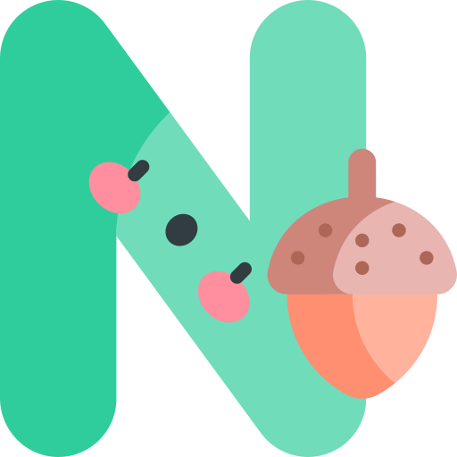

## Hi there, I'm  

 &nbsp; &nbsp; orange tortie cat making cute little apps.  
 &nbsp; &nbsp; currently in coding school for cats.  

<!--
  **phuongv8/phuongv8** is a ✨ _special_ ✨ repository because its `README.md` (this file) appears on your GitHub profile.

  -->
