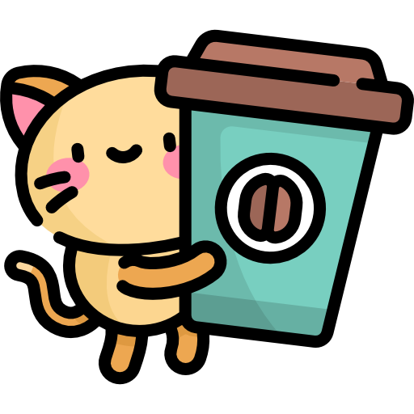

## Hi there, I'm  

 &nbsp; &nbsp; I worked as a Software Engineer at Teksystems, and I'm currently on the lookout for a new Frontend Software Engineer role.  
 &nbsp; &nbsp; I'm learning DSA, React, and system design.  
 &nbsp; &nbsp; I love meeting new people and having casual coffee chats.   If you're interested in chatting about transition to tech, coding, cats, or just life in general, let's connect! [Link to my Calendly](https://calendly.com/phuongv8/15min) 

<!--
  **phuongv8/phuongv8** is a ✨ _special_ ✨ repository because its `README.md` (this file) appears on your GitHub profile.

Here are some ideas to get you started:

- 🔭 I’m currently working on ...
- 🌱 I’m currently learning ...
- 👯 I’m looking to collaborate on ...
- 🤔 I’m looking for help with ...
- 💬 Ask me about ...
- 📫 How to reach me: ...
- 😄 Pronouns: ...
- ⚡ Fun fact: ...
  -->
